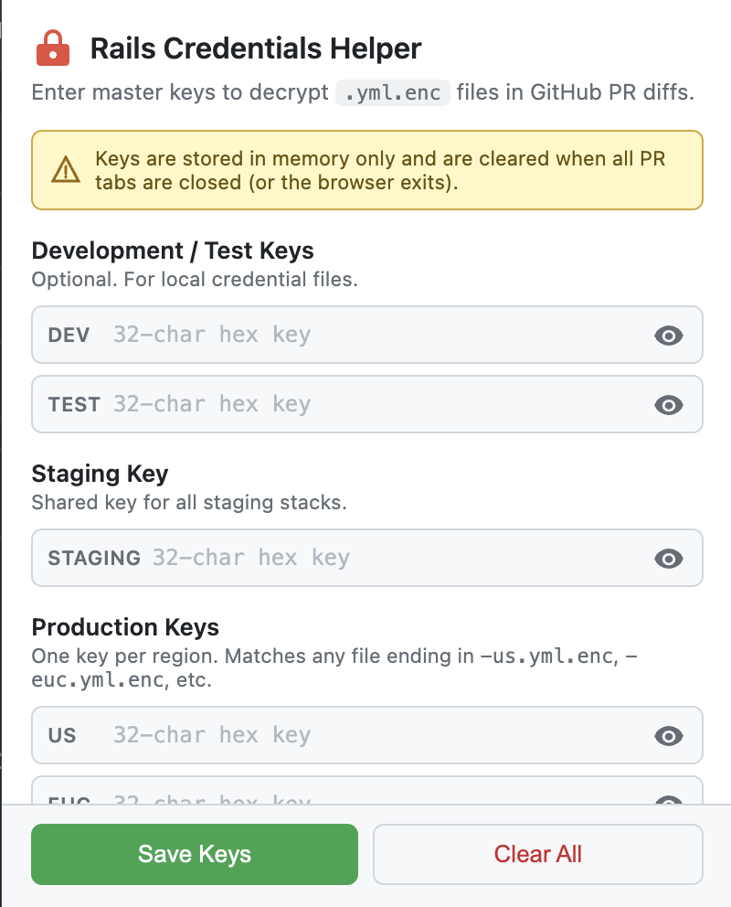

<p align="center">
  
</p>

<h1 align="center">Rails Credentials Helper</h1>

<p align="center">
  A Chrome extension that <strong>decrypts <code>.yml.enc</code> files inline</strong> on GitHub pull request diffs,<br>so you can review credential changes without leaving the browser.
</p>

---

If you've ever opened a PR that touches `config/credentials/production/us.yml.enc` and seen nothing but a wall of base64, this extension is for you.

<p align="center">
  
</p>

## The Problem

Rails encrypts credentials with `ActiveSupport::EncryptedFile` (AES-128-GCM). The `.yml.enc` files that end up in PRs are opaque blobs — you can't tell what actually changed. Reviewing these changes typically means checking out the branch locally and running `rails credentials:edit` for each environment, comparing the output manually.

## How It Works

1. You provide your 32-character hex master keys through the extension popup (one per environment/region).
2. On any GitHub PR page, the extension detects `.yml.enc` file diffs under `config/credentials/`.
3. A **Decrypt** button appears next to each encrypted file.
4. Click it and the extension decrypts both the base and head versions, then renders a proper YAML diff — additions, deletions, and unchanged lines — right inside the PR.

All decryption happens **client-side** using the Web Crypto API. Keys are stored in `chrome.storage.session` (in-memory only) and are automatically cleared when all PR tabs are closed or the browser exits.

## Supported File Layout

The extension expects the standard multi-environment credentials structure:

```
config/credentials/
├── development.yml.enc
├── test.yml.enc
├── staging/
│   └── *.yml.enc
└── production/
    ├── us.yml.enc        (or *-us.yml.enc)
    ├── euc.yml.enc       (or *-euc.yml.enc)
    ├── au.yml.enc        (or *-au.yml.enc)
    ├── ind.yml.enc       (or *-ind.yml.enc)
    ├── eun.yml.enc       (or *-eun.yml.enc)
    └── mec.yml.enc       (or *-mec.yml.enc)
```

Each environment/region maps to a separate master key slot in the popup.

## Installation

1. Clone the repo:
   ```bash
   git clone https://github.com/<your-org>/ruby-creds-chrome-ext.git
   ```
2. Open `chrome://extensions/` and enable **Developer mode**.
3. Click **Load unpacked** and select the cloned directory.
4. Pin the extension for easy access.

No build step, no dependencies — it's plain JS that runs directly in Chrome.

## Usage

1. Navigate to a GitHub PR that modifies `.yml.enc` files.
2. Click the extension icon in the toolbar.
3. Paste the master key(s) for the environments you want to review. Each key is the 32-character hex string from your `config/credentials/<env>.key` file (or `config/master.key` for default credentials).
4. Click **Save Keys**.
5. Back on the PR diff, you'll see a green **Decrypt** button next to each `.yml.enc` file header. Click it.
6. The diff view replaces the encrypted blob with a line-by-line YAML diff.
7. Use **Hide Secrets** / **Show Decrypted** to toggle visibility.

### Finding Your Master Key

```bash
# Default credentials
cat config/master.key

# Environment-specific credentials (Rails 6+)
cat config/credentials/production.key
cat config/credentials/staging.key

# Or check your environment variable
echo $RAILS_MASTER_KEY
```

The key is a 32-character hex string like `abc123def456abc123def456abc123de`.

## Security

- **No network calls.** Decryption uses the browser's built-in [Web Crypto API](https://developer.mozilla.org/en-US/docs/Web/API/Web_Crypto_API) (`AES-GCM`). Keys and decrypted content never leave your machine.
- **Session-only storage.** Keys live in `chrome.storage.session`, which is purely in-memory. They are not written to disk and are cleared when the browser session ends.
- **Auto-cleanup.** The background service worker tracks which tabs have keys. When the last PR tab closes, all keys are removed from session storage.
- **Minimal permissions.** The extension only requests `storage` and `activeTab`, and the content script only runs on `github.com/*/pull/*` URLs.

## How Rails Credential Encryption Works

For the curious, here's what the extension does under the hood:

1. A `.yml.enc` file contains three base64 segments separated by `--`:
   ```
   base64(ciphertext)--base64(iv)--base64(auth_tag)
   ```
2. The master key (32 hex chars) is decoded to 16 raw bytes.
3. AES-128-GCM decryption is performed with the IV and auth tag.
4. The result is a Ruby Marshal-wrapped string (`\x04\x08I"...`). The extension unwraps the Marshal envelope to extract the plain YAML.

This mirrors exactly what `ActiveSupport::EncryptedFile#read` does in Ruby.

## Project Structure

```
├── manifest.json    # Chrome extension manifest (v3)
├── background.js    # Service worker — session key cleanup on tab close
├── popup.html       # Extension popup UI
├── popup.js         # Popup logic — key input, validation, storage
├── popup.css        # Popup styles
├── decrypt.js       # AES-128-GCM decryption + Ruby Marshal parsing
├── content.js       # Content script — finds .yml.enc diffs, renders decrypted YAML
└── content.css      # Injected styles for decrypt button and diff table
```

## Contributing

1. Fork the repo and create a feature branch.
2. Load the unpacked extension from your fork's directory.
3. Make changes — the content script reloads automatically on page refresh, but popup/background changes require clicking the refresh icon on `chrome://extensions/`.
4. Open a PR.

## License

MIT
